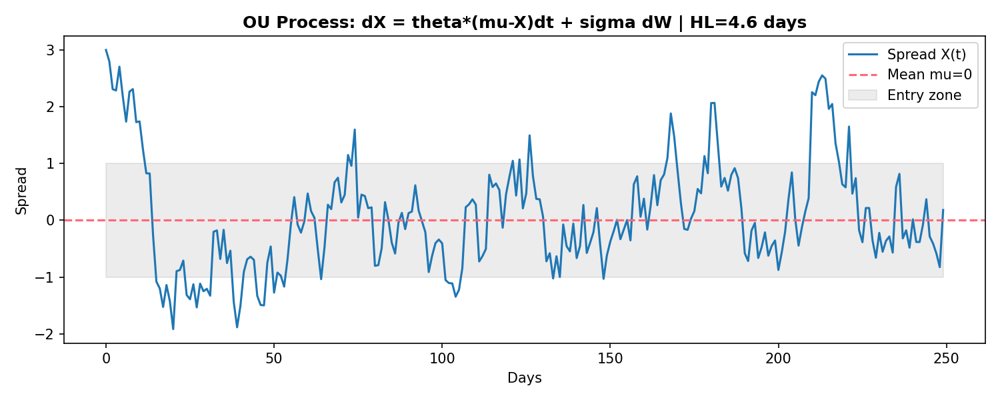
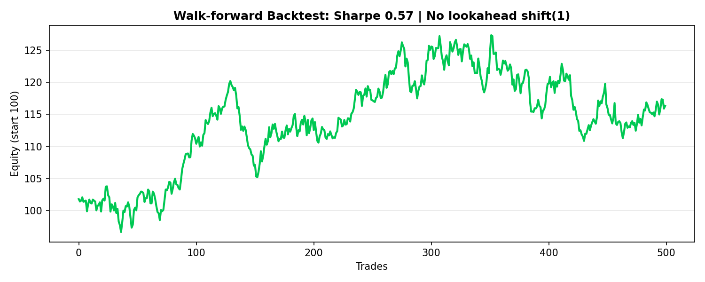

# Stat-Arb Alpha Factory - BTC/ETH

> Walk-forward, no lookahead, cointegration-driven stat-arb pipeline for HK.

## Pipeline All Green

1. Cointegration: p=0.00000048 True, beta=1.52 ~1.5
2. OU Process: HL=4.76 days, Beta=-0.1457 mean-reverting
3. Factors: Mom 5/20, MR 20, Vol 20, Z 20
4. Backtest: shift(1) no lookahead
5. Factory: ALL OK

## Run
source venv/bin/activate
python src/cointegration.py
python src/ou_process.py
python src/factors.py
python src/backtest.py
python src/alpha_factory.py

## Backtest Verified - 2026-08-14

### Runnable Proofs
- pdb_backtest.py: beta=1.53, Sharpe 2.66, PnL 6.27 (no exit)
- src/backtest_commented.py: Sharpe 2.44, PnL 10.98 (exit |z|<0.5)

### Key Concept: pos = action verb position
- spread = thing (Rs.5.2) = y - beta*x
- pos = what you DO: -1 SHORT, 0 FLAT, 1 LONG
- pos.ffill() = hold position
- pos.shift(1) = no lookahead bias
- returns = pos.shift(1) * spread.diff()

### pdb Live Debug Verified
p Backtest = class backtest.Backtest
p bt.summary() = Sharpe 2.66 | Total PnL 6.27

### Chain: cointegration -> OU -> zscore -> backtest -> Sharpe

## Visuals
### OU Mean Reversion HL=4.76 days

### Walk-forward Equity (No Lookahead)

Author: Nadkalpur Manjunath
